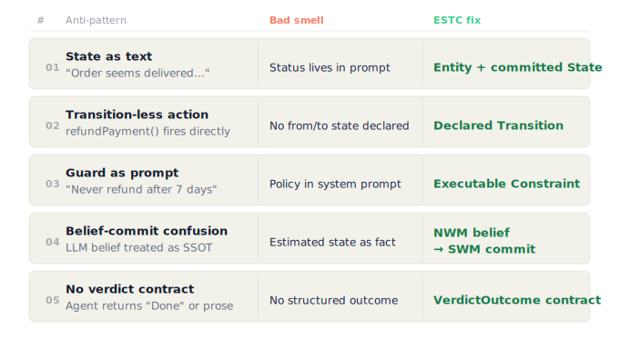
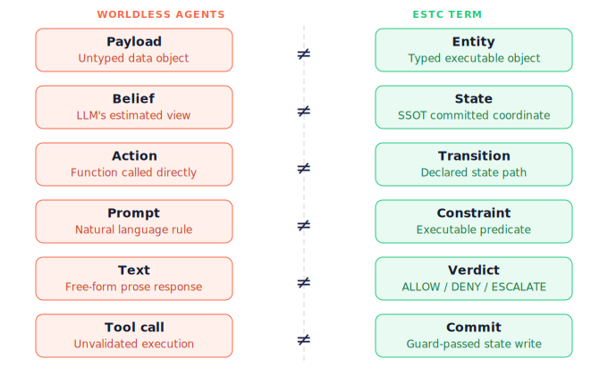

# World Model Anti-Patterns for AI Agents

**Why production agents fail without Entity, State, Transition, and Constraint.**

---

> Most production agent failures are not reasoning failures. They are world-model failures.

> The agent did exactly what it was told.
> The problem was that no one defined the world it was operating in.

Agents hallucinate states, skip constraints, confuse belief with committed facts, and return free-form results instead of executable verdicts. This repo catalogs the most common world-model anti-patterns and shows how to fix them.

---

## What is a world model?

A world model defines:

- **What exists** — the entities your agent operates on (orders, users, payments)
- **What state it is in** — the current committed status of each entity
- **What can change** — the valid transitions from one state to another
- **What must never be violated** — the hard constraints that govern every action

Without a world model, an agent is reasoning about a fiction it constructed from text. That fiction may look correct until it isn't.

---

## ESTC: The four pillars

| Pillar | Question it answers |
|---|---|
| **Entity** | What are the objects in this domain? |
| **State** | What is the current committed condition of each entity? |
| **Transition** | What state changes are allowed, and from where? |
| **Constraint** | What conditions must hold before a transition is permitted? |

ESTC is not a framework. It is a design vocabulary. You can implement it in code, YAML, a DSL, or a typed schema. What matters is that it is explicit, executable, and authoritative — not embedded in a prompt.

---

## Anti-pattern catalog



| # | Anti-pattern | Bad smell |
|---|---|---|
| [01](anti-patterns/01-state-as-text.md) | State as Text | "The order seems delivered…" |
| [02](anti-patterns/02-transition-less-action.md) | Transition-less Action | `refundPayment()` without `Delivered -> RefundRequested` |
| [03](anti-patterns/03-guard-as-prompt.md) | Guard as Prompt | "Never refund after 7 days" buried in a system prompt |
| [04](anti-patterns/04-belief-commit-confusion.md) | Belief-Commit Confusion | LLM belief treated as SSOT |
| [05](anti-patterns/05-no-verdict-contract.md) | No Verdict Contract | Agent returns "Done" instead of ALLOW / DENY / ESCALATE |

---

## The pattern behind the anti-patterns



Most failures come from the same missing boundaries:

```text
Belief ≠ State
Action ≠ Transition
Prompt ≠ Constraint
Text ≠ Verdict
Tool call ≠ Commit
```

ESTC makes those boundaries explicit.

---

## How to read this repo

- **`anti-patterns/`** — Each file covers one anti-pattern: what it looks like, why it fails, and how ESTC fixes it.
- **`examples/bad/`** — Concrete bad examples showing the anti-pattern in action.
- **`examples/good/`** — Concrete good examples showing ESTC-structured alternatives.

You don't need to read in order. Jump to whichever anti-pattern matches a failure you've seen.

---

## Related projects

- [Agentic World Model](https://github.com/swit001/agentic-world-model) — a reference architecture for world-model-aware agents
- [ESTC World Model Runtime](https://github.com/swit001/estc-world-model) — a runtime that enforces ESTC contracts at execution time

---

## License

Apache-2.0. See [LICENSE](LICENSE).
